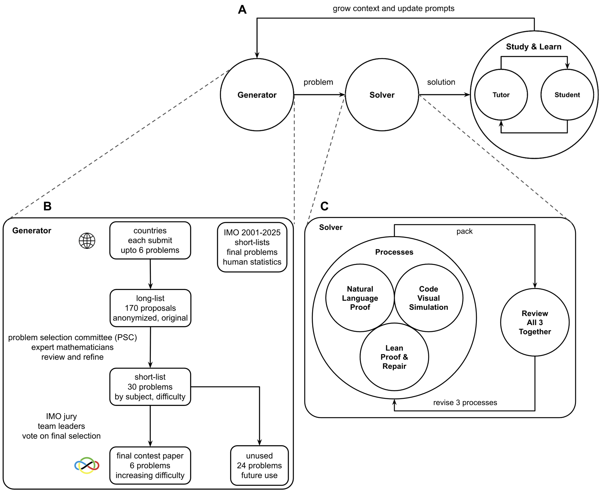

# DRAFT
# [MathEL: Autonomous Self-Improving AI for IMO Combinatorics](https://mathelai.github.io)

A collection of problems, proofs, AI-generated proofs, statistics, simulations, and interactive visualizations for 39 International Mathematical Olympiad (IMO) combinatorics problems between 2000-2025.

## Overview

MathEL generates, solves, and explores mathematical olympiad problems.



1. **Generator** - Models the IMO problem creation process from country submissions to final contest selection for combinatorics problems
2. **Solver** - Employs three complementary approaches in parallel in a build-review loop:
   - Natural Language Proof
   - Code Visual Simulation
   - Lean Proof & Repair
3. **Study & Learn** - Tutor-student interaction text of complete and correct proofs that feeds back to grow context

### Key Features

- **Multiple proof approaches** - Official solutions, AI-generated proofs, and formal Lean 4 proofs
- **Automated grading** - Proof evaluation compared with ground truth solutions
- **Study and learn** - Text of study and learn of correct proofs
- **Python simulations** - Experimental pattern discovery
- **Interactive web visualizations** - Explore problems by browser-based simulations
- **Self-improving loop** - Feedback from tutoring text improves generation and solving by growing context
- **No server required** - Works offline in the browser

## System Architecture

### Problem Generator

The Generator component models the real IMO problem creation pipeline for combinatorics problems:

- **Long-list**: 170 anonymized, original problem proposals from participating countries (each submits up to 6)
- **Problem Selection Committee (PSC)**: Expert mathematicians review and refine submissions
- **Short-list**: 30 problems selected by subject and difficulty
- **IMO Jury**: Team leaders vote on final selection
- **Contest Paper**: 6 problems of increasing difficulty
- **Reserve Problems**: 24 unused problems available for future use

The system incorporates IMO 2001-2025 short-lists, full problems, and human statistics.

### Solver: Parallel Approach

The Solver employs three parallel processes that work together in a build-review loop:

1. **Natural Language Proofs**: AI-generated proofs in natural language
2. **Code Visual Simulation**: Python-based simulation and pattern discovery
3. **Lean Proof & Repair**: Formal proof verification with automated repair

These three processes are reviewed together, allowing insights from one approach to improve the others by iterative refinement.

### Study & Learn Loop

The Tutor-Student context creates a feedback loop that:
- Teaches problems and correct proofs
- Identifies gaps in understanding
- Grows context for both Generator and Solver
- Enables continuous self-improvement

## Quick Start

### Browse Problems

Open `[index.html](https://mathelai.github.io/)` in your web browser to:
- Browse all 39 problems with search, filtering, and sorting
- View problem metadata (year, difficulty, category, nicknames)
- Click any problem card to open its proofs and interactive visualization

### View Individual Problems

Each `imo{YYYY}p{N}/index.html` provides:
- Direct links to all proof types and study materials
- Integrated Lean 4 playground launcher
- Interactive problem visualization with controls

### Run Simulations (Optional)

```bash
# Install dependencies
pip3 install numpy pydantic

# Run a simulation
cd imo2022p1
python3 simulation.py
```

## Project Structure

```
app/
├── index.html                  # Main problem browser UI
├── dataset.js                  # Problem metadata with nicknames
├── mathel.png                  # Logo/figure
├── README.md                   # This file
├── LICENSE                     # MIT License
├── CITATION.cff                # Citation metadata
├── pyproject.toml              # Python dependencies
│
├── styles/                     # CSS stylesheets
│   ├── base.css                # Base styles
│   └── tokens.css              # Design tokens
│
├── icons/                      # Button icons (study, answer, proof types, etc.)
│   ├── icon-study.png
│   ├── icon-answer.png
│   ├── icon-proof-shortlist.png
│   ├── icon-proof-deepthink.png
│   ├── icon-proof-gpt5pro.png
│   ├── icon-sim.png
│   ├── icon-proof-lean.png
│   ├── icon-proof-all.png
│   └── icon-grade.png
│
├── prompts/
│   └── grading.txt             # Grading prompt
│
├── schemas/
│   └── results.schema.json     # Unified results schema
│
├── scripts/
│   └── grade_problems.py       # Automated proof grading script comparing AI and ground truth
│
├── generate_proof_js.py        # Generate proof.js from proof.lean
├── populate_metrics.py         # Populate problem metrics
│
└── imo{YYYY}p{N}/              # 39 problem directories
    ├── index.html              # Interactive visualization
    ├── simulation.py           # Python simulation
    ├── results.json            # Simulation results
    │
    ├── problem.txt             # Problem statement (LaTeX)
    ├── answer.txt              # Ground truth answer
    ├── proof-shortlist.txt     # Official proof(s)
    ├── study.txt               # Study and learning of correct proof
    │
    ├── proof-deepthink.txt     # Gemini DeepThink proof
    ├── proof-gpt5pro.txt       # GPT-5 Pro proof
    ├── proof.lean              # Lean 4 proof code
    ├── proof.js                # Generated JS module for opening Lean proof in Lean 4
    ├── proof.txt               # Combined proof
    │
    └── grade.txt               # AI grading results
```

## Features

### Interactive Problem Browser

The main `index.html` provides:
- **Search** - Find problems by nickname, category, or ID
- **Filters** - By year, category, or difficulty
- **Sorting** - By difficulty (Easy to Hard), year, or problem number
- **Dark/Light theme** toggle
- **Icon-based navigation** - Quick access to all proof types and materials

### Problem Nicknames

Problems have memorable nicknames for easy reference:
- IMO 2022 P1: "The Bank of Oslo"
- IMO 2019 P5: "The Bank of Bath"
- IMO 2013 P6: "Balanced Chords"
- IMO 2022 P6: "Nordic Square"
- And many more...

### Multiple Proof Types

Each problem includes up to 9 different resources, corresponding to the three solver processes:

#### Natural Language Proofs
1. **Proof Shortlist** - Official IMO solution(s)
2. **Proof Deep Think** - AI-generated proof (Gemini DeepThink)
3. **Proof GPT 5 Pro** - AI-generated proof (OpenAI GPT-5 Pro)

#### Code Visual Simulation
4. **Sim** - Interactive Python-based simulation and visualization

#### Lean Proof & Repair
5. **Proof Lean** - Formal proof in Lean 4 (opens live.lean-lang.org)

#### Study & Learn Materials
6. **Study** - Guided learning of problem and correct proof
7. **Answer** - Ground truth answer (not proof)

#### Integration & Evaluation
8. **Proof All** - Combined proof
9. **Grade** - Automated grading comparing AI proofs to ground truth solutions

### Lean 4 Integration

Problems with formal proofs include:
- `proof.lean` - Lean 4 formalization
- `proof.js` - Generated JavaScript module
- Direct integration with [live.lean-lang.org](https://live.lean-lang.org/)
- One-click loading of proof code with LZ-String compression

### Automated Grading

The `scripts/grade_problems.py` tool uses GPT-5 to:
- Evaluate AI-generated proofs against official solutions
- Assign IMO-style grades (0-7)
- Provide detailed justification comments
- Support GPT-5 and GPT-5 Pro models

```bash
# Grade all problems (GPT-5 Pro by default)
export OPENAI_API_KEY='your-key'
python3 scripts/grade_problems.py

# Use regular GPT-5 instead
python3 scripts/grade_problems.py -gpt5

# View help
python3 scripts/grade_problems.py --help
```

Results are saved to `grade.txt` in each problem directory.

## Problem Coverage

### By Year (39 problems total)
- 2025: 2 problems
- 2024: 2 problems
- 2023: 1 problem
- 2022: 2 problems
- 2021: 1 problem
- 2020: 2 problems
- 2019: 2 problems
- 2018: 2 problems
- 2017: 2 problems
- 2016: 2 problems
- 2015: 2 problems
- 2014: 2 problems
- 2013: 2 problems
- 2012: 1 problem
- 2011: 2 problems
- 2010: 1 problem
- 2009: 1 problem
- 2008: 1 problem
- 2007: 1 problem
- 2006: 1 problem
- 2005: 1 problem
- 2004: 1 problem
- 2003: 1 problem
- 2002: 1 problem
- 2001: 2 problems
- 2000: 1 problem

### By Category
All problems are **combinatorics** with subcategories:
- Combinatorial Geometry
- Graph Theory
- Combinatorial Game Theory
- Extremal Combinatorics
- Combinatorial Number Theory

### By Difficulty
Problems appear by IMO score means:
- Easy (≤2.5 mean score)
- Medium (2.5-5.0 mean score)
- Hard (>5.0 mean score)

## Results Schema

All `results.json` files conform to `schemas/results.schema.json`:

```json
{
  "problem_id": "IMO-2022-P1",
  "params": { ... },
  "method": "algorithm_name",
  "metrics": { ... },
  "seed": 42,
  "environment": {
    "python_version": "3.12.0",
    "platform": "Darwin-24.6.0",
    "timestamp": "2025-01-15T10:30:00Z"
  },
  "status": "success"
}
```

## Development

### Generate Lean Proof Modules

After modifying `proof.lean` files:

```bash
python3 generate_proof_js.py
```

This creates `proof.js` modules that enable direct loading into Lean 4 Web.

### Update Problem Metrics

```bash
python3 populate_metrics.py
```

## Requirements

### For Visualizations
- Modern web browser (Chrome, Firefox, Safari, Edge)
- JavaScript enabled
- No internet connection required after download

### For Simulations
- Python 3.8+
- numpy
- pydantic

### For Grading
- Python 3.8+
- openai Python package
- OpenAI API key with GPT-5 access

## Citation

If you use this data or code in your research, please cite:

```bibtex
@software{mathel2025,
  title = {MathEL: Autonomous Self-Improving AI for IMO Combinatorics},
  author = {{MathEL Project}},
  year = {2025},
  url = {https://github.com/mathel/mathel},
  version = {1.0.0}
}
```

See `CITATION.cff` for machine-readable citation metadata.

## License

MIT License - see `LICENSE` file for details.

## Acknowledgments

- Problem statements © International Mathematical Olympiad
- Lean 4 integration powered by [live.lean-lang.org](https://live.lean-lang.org/)
- Compression via [LZ-String](https://pieroxy.net/blog/pages/lz-string/index.html)
- AI proofs generated using OpenAI's GPT-5 Pro and Gemini DeepThink models

## Status Note

This repository is now being updated and is work in progress.
